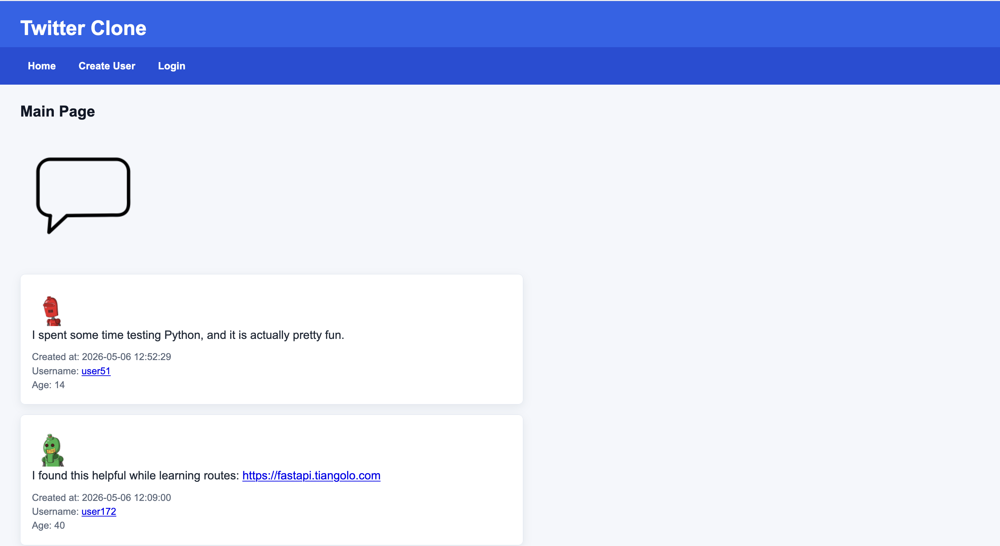

# Twitter Clone

Twitter Clone functions similarly to Twitter (now X). The home page displays a feed of messages, beginning with the newest, and includes user avatars, age, and time the message was created.

## Features

- Create accounts, log in, log out, change passwords, and edit profile descriptions
- Create, edit, delete, and reply to messages
- View message data through a JSON endpoint

## How to Run

Set up the virtual environment and install the packages:

```bash
python3 -m venv venv
source venv/bin/activate
pip install -r requirements.txt
```

Create the database:

```bash
python3 db_create.py
```

Start the server:

```bash
python3 main.py
```

Open the app in a browser:

```bash
http://127.0.0.1:8080
```

## Home Page Screenshot


